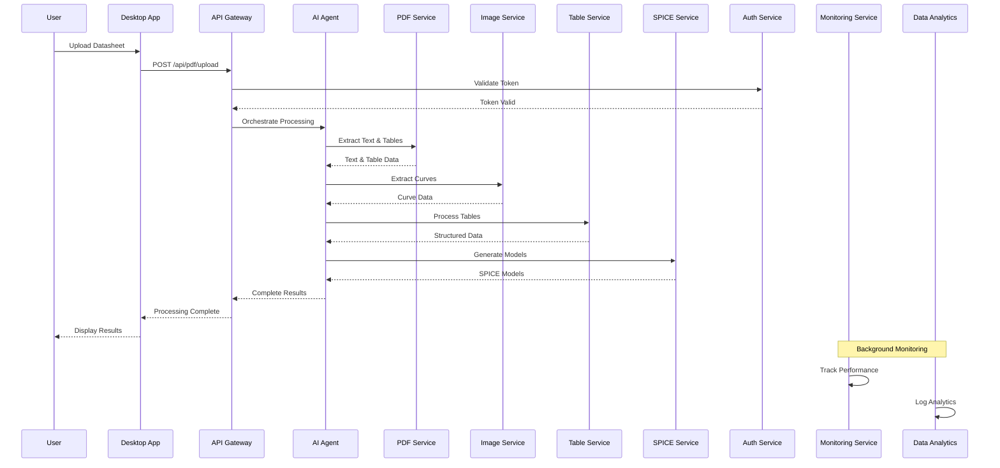
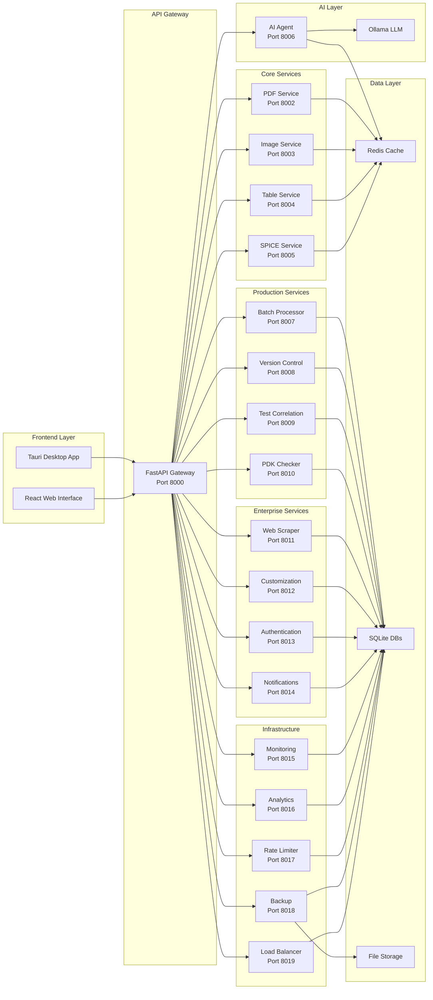
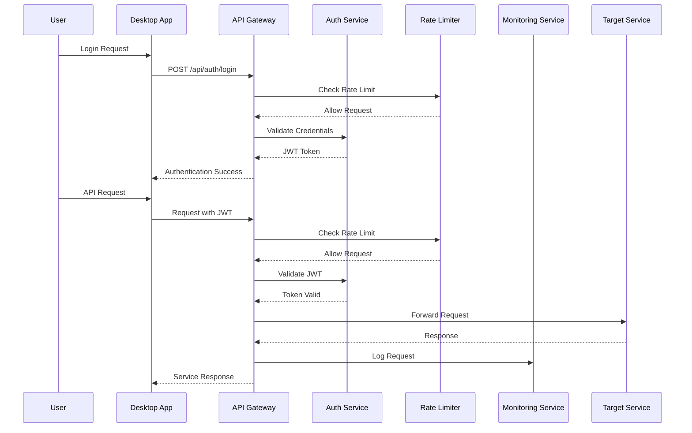
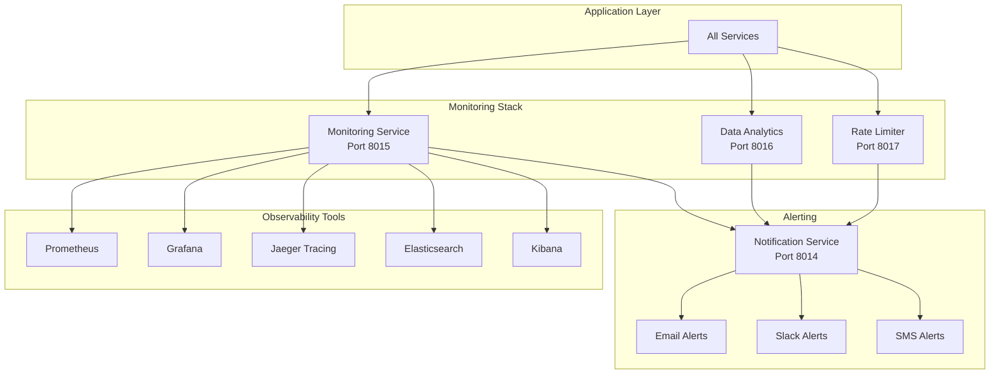
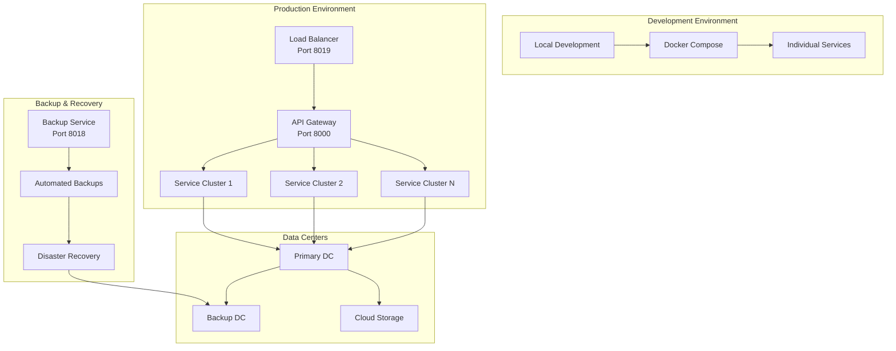
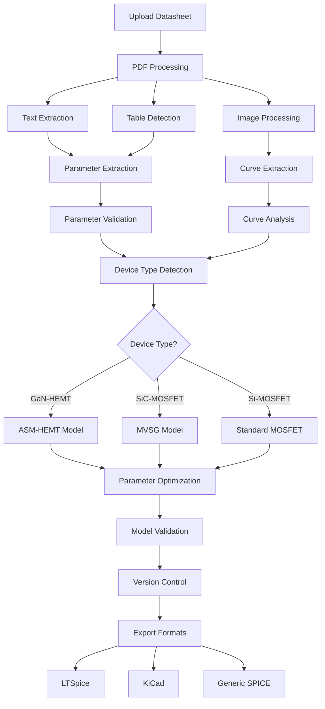
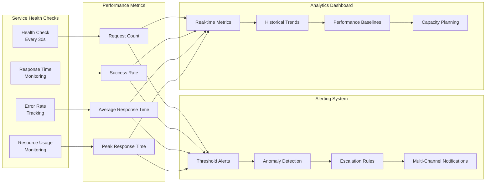
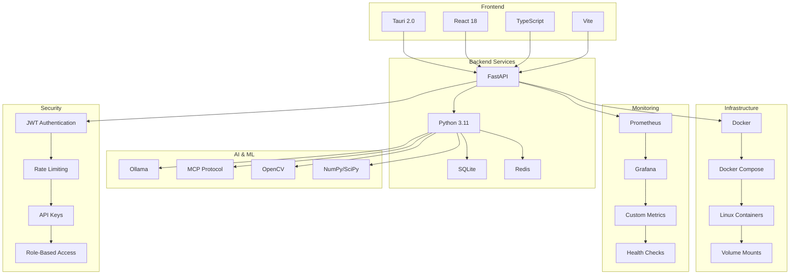

# ESpice Platform - Complete Architecture & Workflow Diagrams

## 🏗️ System Overview Architecture

```mermaid
graph TB
    subgraph "Client Layer"
        A[Desktop App - Tauri]
        B[Web Interface]
        C[Mobile App]
    end
    
    subgraph "API Gateway Layer"
        D[API Gateway - Port 8000]
    end
    
    subgraph "Core Processing Services"
        E[PDF Service - Port 8002]
        F[Image Service - Port 8003]
        G[Table Service - Port 8004]
        H[SPICE Service - Port 8005]
    end
    
    subgraph "AI Orchestration"
        I[AI Agent - Port 8006]
        J[Ollama LLM]
        K[MCP Tools]
    end
    
    subgraph "Production Services"
        L[Batch Processor - Port 8007]
        M[Version Control - Port 8008]
        N[Test Correlation - Port 8009]
        O[PDK Checker - Port 8010]
    end
    
    subgraph "Enterprise Services"
        P[Web Scraper - Port 8011]
        Q[Customization Manager - Port 8012]
        R[Auth Service - Port 8013]
        S[Notification Service - Port 8014]
    end
    
    subgraph "Infrastructure Services"
        T[Monitoring Service - Port 8015]
        U[Data Analytics - Port 8016]
        V[Rate Limiter - Port 8017]
        W[Backup & Recovery - Port 8018]
        X[Load Balancer - Port 8019]
    end
    
    subgraph "Data Layer"
        Y[Redis Cache]
        Z[SQLite Databases]
        AA[File Storage]
        BB[Cloud Storage]
    end
    
    A --> D
    B --> D
    C --> D
    D --> E
    D --> F
    D --> G
    D --> H
    D --> I
    D --> L
    D --> M
    D --> N
    D --> O
    D --> P
    D --> Q
    D --> R
    D --> S
    D --> T
    D --> U
    D --> V
    D --> W
    D --> X
    
    I --> J
    I --> K
    
    E --> Y
    F --> Y
    G --> Y
    H --> Y
    I --> Y
    
    L --> Z
    M --> Z
    N --> Z
    O --> Z
    P --> Z
    Q --> Z
    R --> Z
    S --> Z
    T --> Z
    U --> Z
    V --> Z
    W --> Z
    X --> Z
    
    W --> AA
    W --> BB
```

## 🔄 Data Processing Workflow

## 🏢 Microservices Architecture

## 🔐 Security & Authentication Flow

## 📊 Monitoring & Analytics Architecture

## 🚀 Deployment Architecture

## 🔄 SPICE Model Generation Workflow

## 📈 Service Health & Performance Monitoring

## 🏗️ Technology Stack Overview

## 📋 Service Port Mapping

| Service | Port | Purpose | Dependencies |
|---------|------|---------|--------------|
| API Gateway | 8000 | Request routing & orchestration | All services |
| PDF Service | 8002 | PDF processing & text extraction | None |
| Image Service | 8003 | Image processing & curve extraction | None |
| Table Service | 8004 | Table detection & data extraction | None |
| SPICE Service | 8005 | SPICE model generation | None |
| AI Agent | 8006 | Workflow orchestration | PDF, Image, Table, SPICE |
| Batch Processor | 8007 | Enterprise batch processing | AI Agent |
| Version Control | 8008 | Model versioning & management | SPICE Service |
| Test Correlation | 8009 | Silicon correlation | SPICE, Version Control |
| PDK Checker | 8010 | Foundry compliance | SPICE, Test Correlation |
| Web Scraper | 8011 | Datasheet collection | None |
| Customization Manager | 8012 | User customization | SPICE Service |
| Auth Service | 8013 | Authentication & authorization | None |
| Notification Service | 8014 | Multi-channel notifications | Auth Service |
| Monitoring Service | 8015 | Observability & alerting | Notification Service |
| Data Analytics | 8016 | Business intelligence | Monitoring Service |
| Rate Limiter | 8017 | API rate limiting | Data Analytics |
| Backup & Recovery | 8018 | Data protection | Rate Limiter |
| Load Balancer | 8019 | Traffic distribution | Backup & Recovery |
| Redis | 6379 | Caching & sessions | All services |

## 🎯 Key Features Summary

### **Core Capabilities**
- ✅ **PDF Datasheet Processing**: Automated text and table extraction
- ✅ **Image Processing**: Advanced curve extraction with Rust algorithms
- ✅ **SPICE Model Generation**: ASM-HEMT, MVSG, and standard models
- ✅ **AI Orchestration**: Intelligent workflow automation with MCP tools

### **Production Features**
- ✅ **Enterprise Authentication**: SSO, RBAC, multi-tenant support
- ✅ **Batch Processing**: High-volume document processing
- ✅ **Version Control**: Semantic versioning and rollback capabilities
- ✅ **Test Correlation**: Silicon validation and parameter optimization
- ✅ **PDK Compliance**: Foundry rule validation and compatibility checking

### **Infrastructure Features**
- ✅ **Monitoring & Observability**: APM, tracing, logging, alerting
- ✅ **Data Analytics**: Business intelligence and reporting
- ✅ **Rate Limiting**: API protection and usage management
- ✅ **Backup & Recovery**: Automated data protection
- ✅ **Load Balancing**: High availability and traffic distribution

### **Integration Features**
- ✅ **Web Scraping**: Automated datasheet collection
- ✅ **Customization**: User-defined models and templates
- ✅ **Notifications**: Multi-channel alerting system
- ✅ **Export Capabilities**: LTSpice, KiCad, and generic formats

This comprehensive architecture provides a production-ready, scalable platform for semiconductor datasheet processing with enterprise-grade features, security, and reliability. 